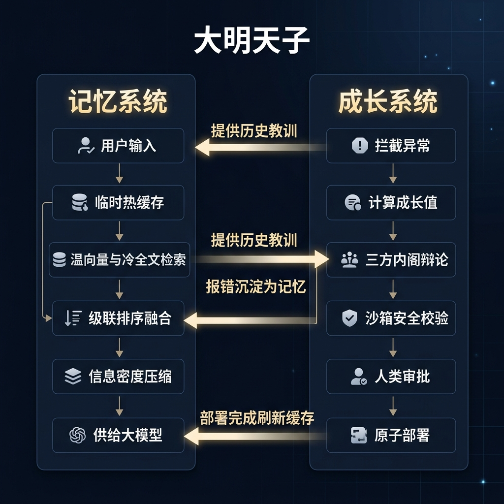

# 大明天子 OS

<p align="center">
  
</p>

<p align="center">
  <b>一个为自主智能体量身打造的工业级防弹底座</b>
</p>

## 💡 项目简介

在以大语言模型为核心的自主智能体开发中，传统的裸奔运行智能体正面临着严峻的生存挑战。尤其是在 OpenClaw 等高权限自主智能体生态中，智能体在缺乏底层保护的情况下直接运行，极易触发以下三大致命痛点：

> ### 🚨 自主智能体裸奔运行的三大致命痛点
> 
> * **资金黑洞**：上下文不断膨胀导致爆仓，API 费用开销呈指数级上升。
> * **越权炸弹**：沙箱内执行自演化代码时缺乏审计，极易遭受黑客攻击或提权破坏。
> * **死循环风暴**：运行报错或逻辑异常导致智能体陷入自我纠错死循环，瞬间榨干 API 配额。

作为 OpenClaw 等高权限自主智能体生态中不可或缺的拼图，**Daming OS** 应运而生。它致力于为高权限自主智能体提供工业级的防弹底座与自演化记忆外脑。Daming OS 提炼自高度复杂的企业级生产实践，将底层的防爆仓记忆引擎与防越权成长沙箱完全抽离解耦，打造为一个轻量且即插即用的软件库，为智能体的安全运行与持续演化保驾护航。

### ⚙️ 系统流转架构图

<p align="center">
  
</p>

---

## 🔄 记忆与成长系统的闭环流转

Daming OS 中的记忆系统与成长系统并非孤立运行，而是通过事件总线与日志通道实现了深度的双向反馈与闭环流转。整体数据与代码流转流程一目了然：

<p align="center">
  
</p>

### ✨ 核心特性

Daming OS 实现了记忆系统与成长系统的高效闭环流转，极限融合出五大黄金核心特性：

* **极速冷温热三层语义缓存与搜索**：基于文件锁与两级缓存实现热数据微秒级响应，避免频繁读取数据库。深度整合密集向量与全文稀疏检索，实现基于语义相似度与文本匹配的多维极速定位。
* **防爆仓自适应网关与物理截断**：响应全局配置以按需检索，在存入记忆库前自动清洗输入中的历史提示词标签，避免循环记忆的逻辑死结。在额度超限时自适应精简历史，并在返回前进行物理长度截断，强制字符切片以誓死防爆仓。
* **安全沙箱与静态安检门**：在隔离沙箱中运行编译级安全检测、静态分析与冒烟测试，强制拦截并封锁高危导入与文件系统反射修改，严防越权与提权，确保代码无毒。
* **异常捕获与多智能体博弈自愈**：实时监听运行报错日志，利用指数衰退滑动窗口计算成长值积分，积满即触发红蓝白三方多智能体博弈辩论，全自动生成高质量代码修复补丁与最佳实践。
* **闭环反思与毫秒级原子部署**：将运行中的所有报错拦截并作为负反馈记忆沉淀至底层，部署前进行物理冷备以支持一键安全回滚，部署完成后刷新缓存使全新行为即刻生效。

---

## 🚀 一键极速安装

在您的终端中执行以下一键安装命令，即可直接从远程 GitHub 仓库拉取并配置包及其全部依赖，无需繁琐的手动克隆和配置：

```bash
pip install git+https://github.com/dylanma8232-art/Daming-OS.git
```

### 脚手架一键生成工作区

安装完成后，在您自己的智能体项目根目录下，运行命令行工具一键生成配置骨架：

```bash
daming-os init --dir ./my-agent-workspace
```

这将在目标目录下自动生成 AGENTS.md 指令规范文件、USER.md 用户授权配置文件以及 .env 环境变量配置文件等。

---

## 🔐 极限安全声明

Daming OS 秉持极端防御主义理念，在安全门控中默认封锁一切高级提权和文件系统反射修改。如开发者的智能体确实需要执行高权限系统操作，请在配置中进行策略授权，或自行微调安检名单以保证合规。
